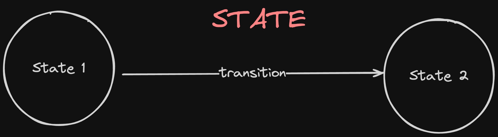
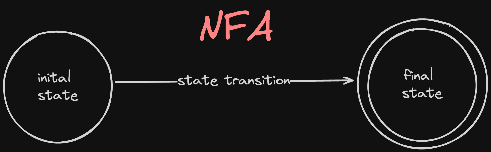
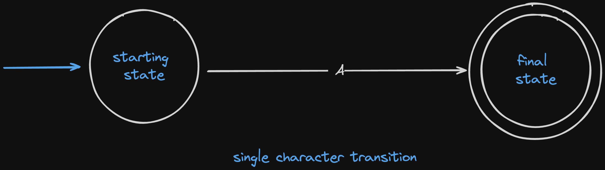
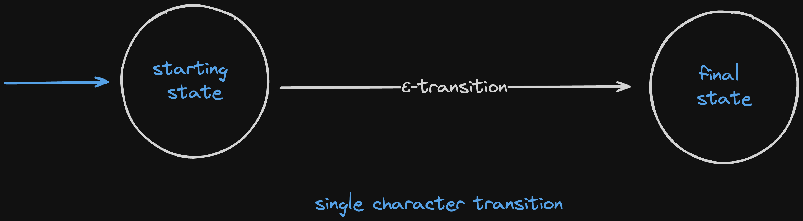

# Regular Expression in Finite State Machine

This project aims to develop a regex matching engine in Rust that converts regular expressions into a Non-deterministic Finite Automaton (NFA), then transforms the NFA into a Deterministic Finite Automaton (DFA), and finally uses the DFA to determine whether a given string matches the regular expression.

why implementing own regex engine ?

> While open-source libraries exist for regex matching, the purpose here is just educational, focusing on the underlying of finite state machines.

> **Note:** It is not recommended to use this project in production unless you want to trust a 21-year-old.

## Project Milestones

1. Implementing NFA State Machine

   - Simple State Construction
   - State Transition
   - Epsilon Transition
   - Concatenation Machine
   - Union Machine
   - Kleene Closure - A\*

2. Converting NFA -> DFA Machine
   - NFA Acceptor
   - Building DFA Table
   - DFA Minimization
   - RegExp Match

### Implementing NFA State Machine

#### Simple State Construction

A `State` in finite automata has an accepting property and a set of states it can transition to with other states.

```rust
pub struct State {
    pub accepting: bool,
    pub transition_map: HashMap<String, Vec<Rc<RefCell<State>>>>,
}
```

A simple state transition from one state to another is shown below.



---

Similar to this, in automata theory, we will construct the NFA as follows:

```rust
pub struct NFA {
    pub in_state: Rc<RefCell<State>>,
    pub out_state: Rc<RefCell<State>>,
}
```



In the NFA state machine, we define some rules: the `in_state` must have accepting set to `false`, and only one `out_state` should be in the accepting state i.e `true`.

---

### NFA State Machines

#### Single Transition

A single transition represents moving from one state to another based on a specific input symbol.



In this diagram, state S1 transitions to state S2 on input 'a'.

#### Epsilon Transition

An `ε-transition` (epsilon transition) allows the NFA to transition from one state to another without consuming any input symbols.


